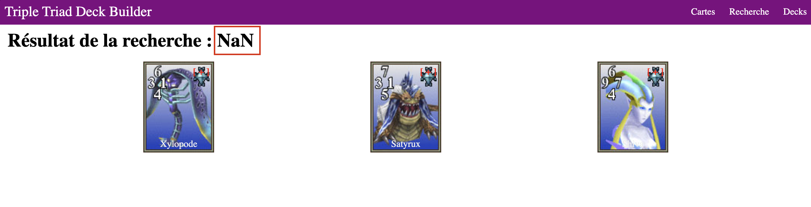
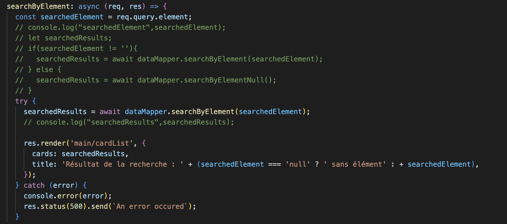
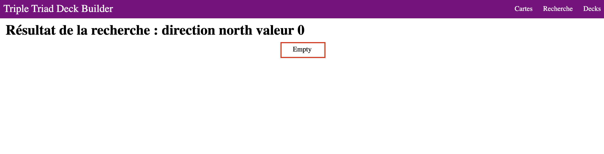
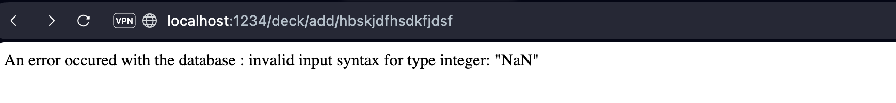

# Apprenant 1

**Étape 1: Détail d’une carte**

Peut-être ajouter une condition lorsque l'élément d'une carte est vide ou NaN. Ce serait plus joli, je pense.


**Étape 2: Recherche**

Lorsqu'on recherche par élément, on peut voir s'afficher sur la page un "NaN", ce qui peut désorienter l'utilisateur.

- Route: [http://localhost:1234/search/element?element=glace](http://localhost:1234/search/element?element=glace)
    
    
    

Si le code est terminé, il est important de supprimer les commentaires de code pour le rendre plus lisible (voir capture d'écran ci-dessus). Les commentaires de code représentent du code inutilisé et doivent donc être supprimés..



**Étape 3: Construire un deck**

Le cahier des charges est bien respecté, les cartes s'ajoutent correctement, on ne peut pas en ajouter plus de 5 et il n'est pas possible d'ajouter deux fois la même carte. De plus, la suppression fonctionne très bien. Bravo !

**Étape Bonus:**

- Route: [http://localhost:1234/search/values?direction=north&value=0](http://localhost:1234/search/values?direction=north&value=0)
    - Quand il n'y a pas de valeur, il est peut-être possible de personnaliser un peu le message à la place d'un "empty", afin d'afficher un message plus clair et en français.
        
        
        

**Conclusion:**

Dans l'ensemble, le cahier des charges a été bien respecté, donc félicitations.

Cependant, dans un souci d'amélioration, nous pourrions améliorer certains petits éléments dans le code.

**Exemple:**

- Si j’essaie de contourner un peu le système en mettant une chaîne de caractères dans l’URL: [http://localhost:1234/deck/add/hbskjdfhsdkfjdsf](http://localhost:1234/deck/add/hbskjdfhsdkfjdsf).
    
    
    

- Il serait potentiellement nécessaire de mettre un “try catch” sur le cast de la variable.

```jsx
const cardId = Number(req.params.id);

// Propositions
try {
	const cardId = Number(req.params.id);
} catch (error) {
	throw "Error cast params"
}
```