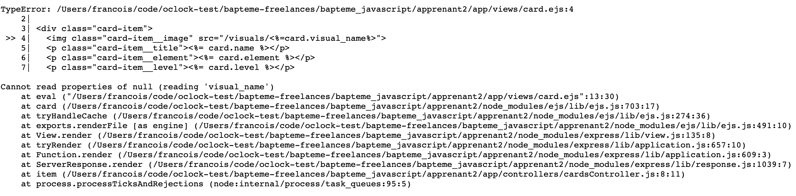
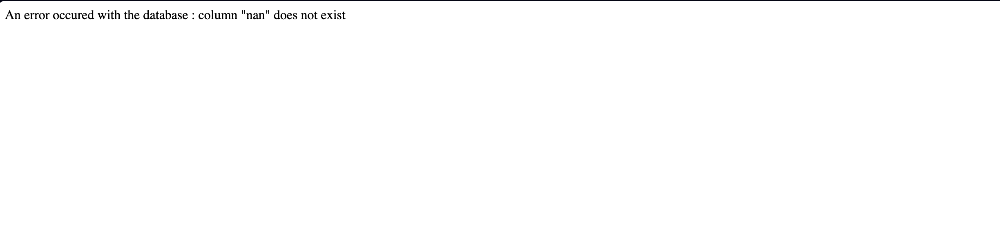

# Apprenant 2

**Étape 1:**

La requête de récupération d'une carte fonctionne bien pour ce qui est demandé. Cependant, lorsqu'on essaie de jouer un peu avec, on constate que les erreurs ne sont pas gérées.

Exemple, quand me met un ID, qui n’existe pas:

- Sur la route “[http://localhost:1234/card/](http://localhost:1234/card/23456789){cardId}”, les 404 ne sont pas géré (voir screen)
    - Exemple: [http://localhost:1234/card/23456789](http://localhost:1234/card/23456789)

Autre exemple: 

- Si je met des lettres dans l’URL [http://localhost:1234/card/sdjkfsdf](http://localhost:1234/card/sdjkfsdf)

Quand on développe, il est toujours bon de penser à ce genre de cas. Il faut que cela devienne un réflexe de penser aux effets secondaires dans une application web.

**Étape 2: Recherche**

Globalement, la recherche par élément fonctionne bien, sauf lorsqu'on sélectionne l'élément "aucun". Dans ce cas, aucun résultat n'est renvoyé alors qu'il devrait y en avoir. Cependant, cela est dû à la requête qui ne renvoie que les cartes avec des éléments "NOT NULL".

J'ai été voir ton code pour comprendre :

- Tu récupères toutes les cartes à chaque requête
- Ensuite, tu les filtres avec la méthode "array.filter()" en JavaScript.

Alors oui, je suis d'accord, ça fonctionne, mais ce n'est peut-être pas la meilleure chose à faire. Le SQL est un langage qui est fait pour filtrer les données, donc ce serait mieux d'utiliser la puissance de ce dernier et ça éviterait de faire une double requête.

Pour cet exercice, je te conseille vraiment d'aller voir la correction du code que tu as reçu pour comprendre ce que je t'ai expliqué ci-dessus.

**Étape 3: Construire un deck:**

**Étape 3.2: Ajouter une carte au deck:**

La construction d'un deck est fonctionnelle. Cependant, l'une des règles de gestion n'a pas été prise en compte. Dans le cahier des charges, il est demandé de limiter le deck à un maximum de 5 cartes, mais je peux en mettre beaucoup plus.

**Étape 3.3: Visualiser le deck:**

On peut visualiser le deck, mais je vois juste un petit "$" qui est resté et qu'il faudrait supprimer.

**Étape 3.4: Supprimer une carte du deck:**

Normalement sur la page “/deck”, on devrait pouvoir supprimer une carte, mais actuellement on ne peut pas le faire

**Conclusion:**

J'ai l'impression que tu n'as pas eu le temps de tout faire. Est-ce un problème de temps ?

Globalement, on y retrouve quelques bugs. Il faudrait passer un peu plus de temps à tester et à bien lire les consignes pour voir si ton code prend tout en compte et essayer aussi de prendre en compte les effets de bord. Je préférerais que tu fasses un peu moins, mais que les choses faites soient bonnes. Ainsi, tu auras tous les bons réflexes pour la suite.