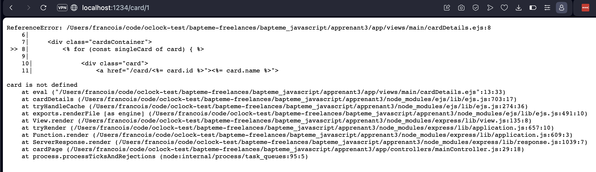

# Apprenant 3

**Étape 1: Détail d'une carte**

Les liens sur les cartes ont été ajoutés. Cependant, lorsque je vais sur la page d'une carte, j'ai une erreur. Je pense qu'il y a juste un petit problème avec les noms de variables. J'ai l'impression que tu n'as pas testé ton développement, il faudrait le faire à chaque fois, c'est très important.



**Étape 2: Recherche**

La recherche par élément ne fonctionne pas non plus. J'ai regardé rapidement dans ton code et j'ai l'impression que tu as tendance à mélanger les noms de fonction et les noms de variable. Adopte une règle pour nommer les fonctions et une autre pour les variables. Ton code y gagnera beaucoup en lisibilité.


```jsx
const result = await dataMapper.cardElement(element);
// J'ai rechercher dans le code mais la méthode "cardElement" n'existe pas
```

Essaie vraiment de tester ton code, en faisant des petits tests. Tu aurais très vite vu qu'il y avait un problème.

**Étape 3 : Construire un deck**

**3.2 Ajouter une carte au deck:**

L'ajout des cartes ne fonctionne pas bien non plus.

**3.3 Une page pour visualiser le deck !**

Pareil, j'ai également une erreur d'affichage pour un deck.

**3.4 Supprimer une carte du deck**

Je ne peux pas tester cette partie à cause des bugs ci-dessus.

**Conclusion**

Comme tu peux le voir, il y a pas mal d'erreurs. Ce que je peux proposer, c'est qu'on se fasse une visio tous les deux sur un exercice afin que je comprenne ta façon de travailler et que l'on voie ce qu'on peut améliorer ensemble pour éviter ce genre de choses ne ce reproduise par la suite. Est-ce que cela te conviendrait ?